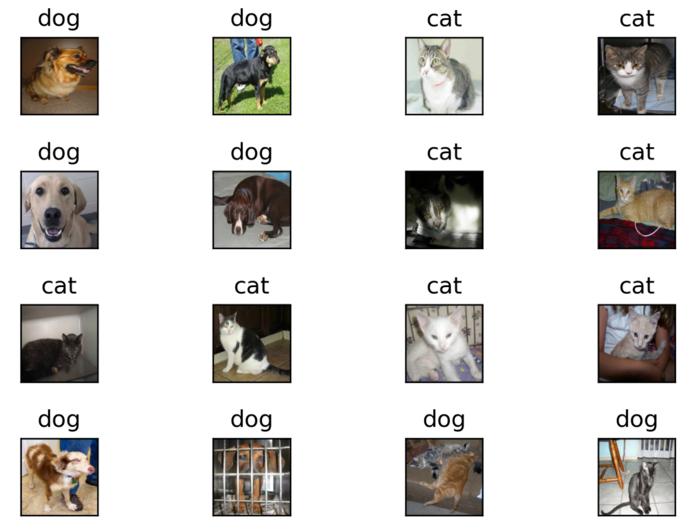

# Pytorch深度學習框架X NVIDIA JetsonNano應用-線性回歸與實作

| 作者 | Chia-Chun, Chang |
| ---- | ---|
| 所屬單位  | Cavedu 教育團隊 |
| 開發日期  | 10908 |
| 文章連結  | https://www.rs-online.com/designspark/pytorchx-nvidia-jetsonnano-cn |

___

## 介紹
本篇文章將使用Jetson Nano做出一個非常簡單的貓狗分類器，其中用到PyTorch的ImageFolder做數據集並且用DataLoader將數據集載入的技術，並且學會用自己建置的CNN來訓練，最後取出測試圖片來做預測。

